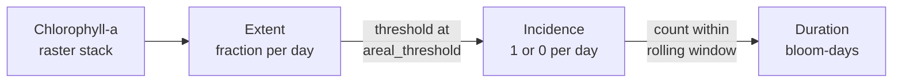

# Metrics overview

All of `atomic_metrics.R` is organized around one idea: the three bloom metrics are **layers of the same computation**, not independent calculations.



Incidence is extent with a threshold applied. Duration is incidence counted inside a rolling window. Because of that, computing all three costs barely more than computing extent alone provided you reuse intermediate results rather than recomputing them.

## Three ways to call everything

Each metric is exposed in up to three forms. They return the same numbers; they differ in what they accept and how much work they repeat.

| Form | Example | Takes | Use when |
| --- | --- | --- | --- |
| **Atomic** | [`extent()`](extent.md#extent), [`incidence()`](incidence.md#incidence) | One 2D layer | You have a single day, or you are reading the source to understand the logic |
| **Wrapper** (`_wrap`) | [`extent_wrap()`](extent.md#extent_wrap), [`incidence_wrap()`](incidence.md#incidence_wrap) | A 3D array | You want one metric across a whole stack |
| **Derived** (`_from_`) | [`incidence_from_extent()`](incidence.md#incidence_from_extent), [`duration_from_incidence()`](duration.md#duration_from_incidence) | Results of the previous stage | You want several metrics - **this is the most efficient path** |

The wrappers are thin: they are `apply(arr, MARGIN = 3, FUN = ...)` over the layer dimension.

!!! tip "Prefer the derived forms when computing more than one metric"

    `incidence_wrap()` recomputes extent internally, and `duration()` recomputes both extent and incidence. If you already have extent results, feeding them to `incidence_from_extent()` skips that work entirely. The example script confirms all methods compute identical results:

    ```r
    all(incidences_ext == incidences_wrp)   # TRUE
    ```

## Arrays in, rasters at the edges

Metric functions take **base R 3D arrays**, not `SpatRaster` objects. Convert at the boundary:

```r
extent_wrap(as.array(my_raster), q_threshold = 15)
```

The array's third dimension is time - one layer per day.

There is one deliberate exception. [`duration()`](duration.md#duration) takes a `SpatRaster` because it needs the raster's time index via `terra::time()`; an array carries no dates. If you already have an incidence vector and its timestamps, use `duration_from_incidence()` instead and the exception does not apply.

[`create_subdomain()`](create-subdomain.md) is the other raster-native function. It clips a stack to a lake segment before any metric is computed.

## Shared parameters

Two thresholds appear throughout, and they behave differently at their boundaries:

`q_threshold`

:   Chlorophyll-a concentration in µg/L above which a **cell** counts as blooming. Values between 15-20 are commonly used. The threshold cutoff is **Exclusive**; a cell exactly equal to `q_threshold` is *not* a bloom.

`areal_threshold`

:   Fraction of the subdomain that must be blooming before the **day** counts as a bloom events. `0.20` is the project default. This area threshold is **Inclusive**; extent exactly equal to `areal_threshold` *is* a bloom.

`window_size` / `step_size`

:   Rolling-window length and stride for duration, both in number of layers (days).

!!! warning "No default arguments"

    Every function requires its thresholds to be passed explicitly. This is intentional: the choice of `q_threshold` materially changes results, and a silent default would let two analyses diverge without anyone noticing. Expect an error, not a fallback, if you omit one.

## Pages

- [Extent](extent.md) — `extent()`, `extent_wrap()`
- [Incidence](incidence.md) — `incidence()`, `incidence_wrap()`, `incidence_from_extent()`
- [Duration](duration.md) — `duration_from_incidence()`, `duration()`
- [Subdomains](create-subdomain.md) — `create_subdomain()`
